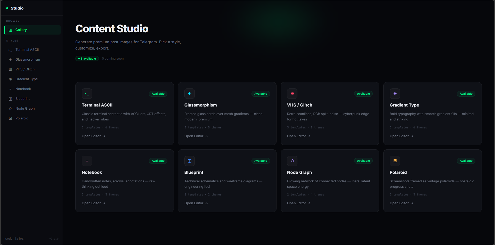

# ✦ SJ Studio

> Premium content creation studio for Telegram — generate stunning post images with 8 unique visual styles.



---

## ⚡ Features

- **8 Visual Styles** — Terminal ASCII, Glassmorphism, VHS/Glitch, Gradient Typography, Notebook, Blueprint, Node Graph, Polaroid
- **20+ Templates** — PFP cards, announcements, quotes, articles, checklists, spec sheets, system diagrams, photo walls & more
- **25+ Color Themes** — from Matrix Green and Synthwave to Classic Cream and Darkroom
- **Live Canvas Preview** — see your changes in real-time as you type
- **One-Click Export** — download as high-res PNG
- **Configurable Branding** — your name, your handle, your identity across all styles
- **CRT Effects** — scanlines, curvature, and glow controls for that authentic retro feel

## 🎨 Styles

| Style              | Description                                | Templates | Themes |
| ------------------ | ------------------------------------------ | --------- | ------ |
| **Terminal ASCII** | CRT terminal with ASCII art, hacker vibes  | 5         | 6      |
| **Glassmorphism**  | Frosted glass cards over mesh gradients    | 3         | 5      |
| **VHS / Glitch**   | Retro scanlines, RGB split, noise          | 3         | 1      |
| **Gradient Type**  | Bold typography with smooth gradient fills | 3         | 6      |
| **Notebook**       | Handwritten notes on lined paper           | 2         | 3      |
| **Blueprint**      | Technical schematics and wireframes        | 2         | 2      |
| **Node Graph**     | Glowing network of connected nodes         | 2         | 4      |
| **Polaroid**       | Vintage photo frames on cork board         | 2         | 3      |

## 🚀 Getting Started

```bash
# Install dependencies
npm install

# Run development server
npm run dev
```

Open [http://localhost:3000](http://localhost:3000) to browse styles and start creating.

## 🛠 Tech Stack

- **Framework:** Next.js 15 (App Router)
- **Language:** TypeScript
- **Styling:** Tailwind CSS v4
- **Rendering:** Canvas 2D API
- **Fonts:** Inter, JetBrains Mono, Outfit, Caveat, Space Mono (Google Fonts)

## 📁 Project Structure

```
studio/
├── app/                    # Next.js app routes
│   ├── editor/[style]/     # Dynamic editor page
│   └── page.tsx            # Gallery homepage
├── components/
│   ├── editor/             # Canvas preview, control panel
│   └── layout/             # Sidebar, topbar
├── lib/
│   ├── styles/             # Style engines
│   │   ├── terminal/       # Terminal ASCII
│   │   ├── glass/          # Glassmorphism
│   │   ├── glitch/         # VHS / Glitch
│   │   ├── gradient/       # Gradient Typography
│   │   ├── notebook/       # Notebook
│   │   ├── blueprint/      # Blueprint
│   │   ├── neural/         # Node Graph
│   │   └── polaroid/       # Polaroid
│   ├── registry.ts         # Style engine registry
│   ├── styles.ts           # Gallery metadata
│   ├── types.ts            # Shared TypeScript types
│   └── utils.ts            # Helpers (text wrap, export, etc.)
└── hooks/
    └── useCanvas.ts        # Canvas rendering hook
```

Each style has two files:

- `config.ts` — templates, themes, defaults, field visibility
- `engine.ts` — Canvas 2D render functions

## 📝 Adding a New Style

1. Create `lib/styles/<slug>/config.ts` with templates, themes, and defaults
2. Create `lib/styles/<slug>/engine.ts` implementing the `StyleEngine` interface
3. Register in `lib/registry.ts`
4. Add metadata to `lib/styles.ts`
5. Add field visibility to `app/editor/[style]/page.tsx`

## 📜 License

MIT

---

_Built for the [sudo jajos](https://t.me/sudo_jajos) community_
